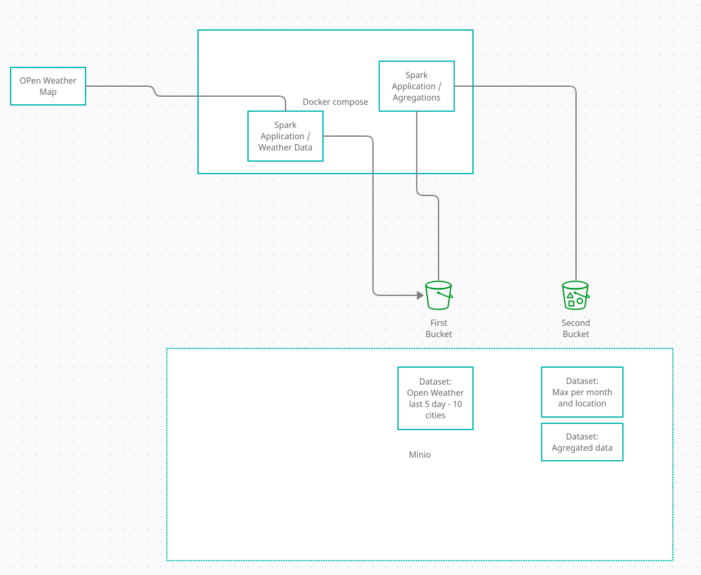
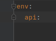

# open-weather-map-deduplicated

This project extracts data from open weather map and generates a few datasets in minio.



# How to run
Please, make sure to add an api key of open weather map in config.yaml.
You might see in this section:

### docker compose
You only need to have docker installed to run this project.
```bash
docker-compose up -d
```

To stop and remove dependencies
```bash
docker-compose down -v
```

# Datasets

## First step
Raw Open Weather for 10 cities and 5 days.
```html
+--------------------+--------------------+---+---+-----------------+---------------+
|             current|              hourly|lat|lon|         timezone|timezone_offset|
+--------------------+--------------------+---+---+-----------------+---------------+
|{rain -> null, te...|[{temp -> null, v...| 31|121|    Asia/Shanghai|          28800|
|{temp -> null, su...|[{temp -> null, v...|-22|-43|America/Sao_Paulo|         -10800|
|{temp -> null, su...|[{temp -> null, v...| 41| 12|   Europe/Vatican|           3600|
|{temp -> null, su...|[{temp -> null, v...| 48|  2|     Europe/Paris|           3600|
|{temp -> null, su...|[{temp -> null, v...| 59| 10|      Europe/Oslo|           3600|
|{temp -> null, su...|[{temp -> null, v...| 41| 12|   Europe/Vatican|           3600|
|{temp -> null, su...|[{temp -> null, v...| 64| 21| Europe/Stockholm|           3600|
|{temp -> null, su...|[{temp -> null, v...|-22|-43|America/Sao_Paulo|         -10800|
|{temp -> null, su...|[{temp -> null, v...|  5| 55|        Etc/GMT-4|          14400|
|{temp -> null, su...|[{temp -> null, v...| 64| 21| Europe/Stockholm|           3600|
|{temp -> null, su...|[{temp -> null, v...| 64| 21| Europe/Stockholm|           3600|
|{temp -> null, su...|[{temp -> null, v...|-22|-43|America/Sao_Paulo|         -10800|
|{temp -> null, su...|[{rain -> null, t...|  5| 55|        Etc/GMT-4|          14400|
|{temp -> null, su...|[{temp -> null, v...| 34|135|       Asia/Tokyo|          32400|
|{temp -> null, su...|[{temp -> null, v...| 59| 10|      Europe/Oslo|           3600|
|{temp -> null, su...|[{temp -> null, v...| 16| 96|        Etc/GMT-6|          21600|
|{rain -> null, te...|[{temp -> null, v...| 31|121|    Asia/Shanghai|          28800|
|{temp -> null, su...|[{temp -> null, v...|-22|-43|America/Sao_Paulo|         -10800|
|{temp -> null, su...|[{temp -> null, v...| 34|135|       Asia/Tokyo|          32400|
|{rain -> null, te...|[{rain -> null, t...|  5| 55|        Etc/GMT-4|          14400|
+--------------------+--------------------+---+---+-----------------+---------------+
```


## Second Step
Max per month
```html
 +----------+-----+----+----+----+
 |  location|month|year|temp| max|
 +----------+-----+----+----+----+
 | {34, 135}|    2|2022| 285| 285|
 |   {48, 2}|    3|2022|null|null|
 |  {59, 10}|    3|2022| 279| 279|
 |   {5, 55}|    3|2022|null|null|
 |  {64, 21}|    2|2022|null|null|
 |{-22, -43}|    2|2022|null|null|
 |{-22, -43}|    3|2022| 294| 294|
 | {31, 121}|    3|2022|null|null|
 |  {16, 96}|    3|2022|null|null|
 |  {16, 96}|    2|2022| 301| 301|
 |{-22, -43}|    3|2022|null|null|
 |   {5, 55}|    2|2022|null|null|
 |  {64, 21}|    3|2022|null|null|
 | {31, 121}|    2|2022|null|null|
 |{-22, -43}|    3|2022| 293| 293|
 | {34, 135}|    2|2022| 281| 281|
 |  {41, 12}|    2|2022|null|null|
 |  {46, 30}|    3|2022|null|null|
 | {34, 135}|    3|2022|null|null|
 |  {16, 96}|    2|2022|null|null|
 +----------+-----+----+----+----+
```

Aggregated
```html
+---------+-------------------+----+-------+---------------+---------------+
| location|          date_temp|temp|avg_min|max_temperature|min_tempurature|
+---------+-------------------+----+-------+---------------+---------------+
|{34, 135}|2022-02-27 00:00:00|null|   null|          false|           true|
|{34, 135}|2022-02-27 09:00:00| 285|  283.0|           true|          false|
| {16, 96}|2022-02-28 00:00:00|null|   null|          false|           true|
| {16, 96}|2022-02-28 07:00:00| 301|  288.0|           true|          false|
|  {5, 55}|2022-03-01 00:00:00|null|   null|          false|           true|
|  {5, 55}|2022-03-01 01:00:00| 300|  296.5|           true|          false|
|  {5, 55}|2022-03-03 00:00:00|null|   null|          false|           true|
| {59, 10}|2022-03-03 11:00:00| 279|  277.0|           true|          false|
| {46, 30}|2022-03-02 00:00:00|null|   null|          false|           true|
|  {5, 55}|2022-03-02 02:00:00| 300|  297.0|           true|          false|
+---------+-------------------+----+-------+---------------+---------------+
```

